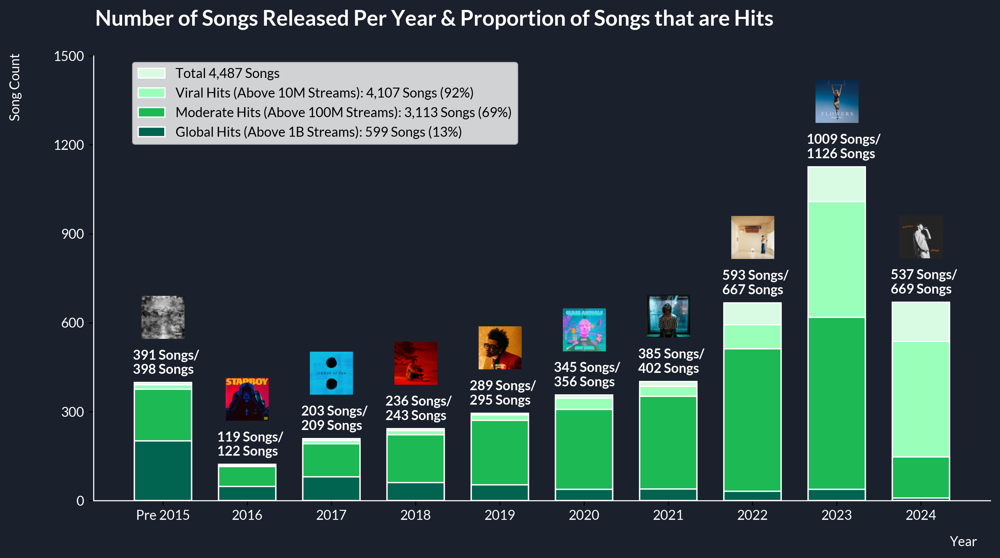

# Spotify-EDA-and-Visualization

## Overview
This was a final group project for University of San Francisco MS in Data Science's EDA and Visualizaiton (MSDS 593) course of Summer 2024. We chose ["Most Streamed Spotify Songs 2024"](https://www.kaggle.com/datasets/nelgiriyewithana/most-streamed-spotify-songs-2024/data) in Kaggle for our exploratory data analysis, visualization of the data, and business insights extraction. I used Python (numpy, pandas, matplotlib) to observe, find missing values and outliers, categorize, and select the necessary data to achieve the below requirements.

## Requirements
- A high-level summary of the data through EDA.
- Some highlight facts about the data through well-designed visualizations.
- Some ideas about how to use this data in business or policy from what you have
learned.
- Present the above to the audience.

## Dataset Explanation
This dataset presents a comprehensive compilation of the most streamed songs on Spotify in 2024. It provides extensive insights into each track's attributes, popularity, and presence on various music platforms, offering a valuable resource for music analysts, enthusiasts, and industry professionals. The dataset includes information such as track name, artist, release date, ISRC, streaming statistics, and presence on platforms like YouTube, TikTok, and more.

## Jupyter Notebook Links
Suhho Lee: [Link](https://github.com/suhholee/Spotify-EDA-and-Visualization/blob/main/MSDS%20593_Group%2023_Suhho%20Lee_Final%20Presentation.ipynb)

Trevor Eaton: [Link](https://github.com/suhholee/Spotify-EDA-and-Visualization/blob/main/MSDS%20593_Group%2023_Trevor%20Eaton_Final%20Presentation.ipynb)

Thi Nguyen: [Link](https://github.com/suhholee/Spotify-EDA-and-Visualization/blob/main/MSDS%20593_Group%2023_Thi%20Nguyen_Final%20Presentation.ipynb)

## Introduction
Our team envisioned ourselves as the data science department at Spotify. Our main focus was on leveraging data-driven insights to enhance Spotify’s continued growth in revenue and user engagement.

  

References
- [Spotify Expands to Six More Countries Around the World](https://newsroom.spotify.com/2021-11-17/spotify-expands-to-six-more-countries-around-the-world/)
- [Spotify Financials](https://investors.spotify.com/financials/default.aspx)

Our approach aims to align with Spotify’s mission statement: 

***"Unlock the potential of human creativity by giving a million creative artists the opportunity to live off their art and billions of fans the opportunity to enjoy and be inspired by it."*** 

To achieve this, we have focused on identifying emerging artists with potential and promoting them to our user base.

## Data Clean-up and Selection
Our data preparation process involved cleaning, transforming, and selecting relevant data columns to ensure a robust analysis. Below is an overview of the steps:
### Data Types
- Converted all the numerical data into floats
- Converted ‘Release Date’ into datetime objects
- Added a ‘Release Year’ column from ‘Release Date’
```python
df['Release Date'] = pd.to_datetime(df['Release Date'])
new_col = ['Spotify Streams', 'Spotify Playlist Count', 'Spotify Playlist Reach', 'YouTube Views', 'YouTube Likes', 'TikTok Posts', 'TikTok Likes', 'TikTok Views', 'YouTube Playlist Reach', 'AirPlay Spins', 'SiriusXM Spins', 'Deezer Playlist Reach', 'Pandora Streams', 'Pandora Track Stations', 'Soundcloud Streams', 'Shazam Counts']
df[new_col] = df[new_col].replace(',', '', regex=True).apply(pd.to_numeric)
df['All Time Rank'] = pd.to_numeric(df['All Time Rank'].replace(',', '', regex=True), downcast='integer')
df['Explicit Track'] = df['Explicit Track'].replace({0: False, 1: True}).astype('category')
df_spotify['Release Year'] = df_spotify['Release Date'].dt.year
```
### Missing Data
- Removed the ‘TIDAL Popularity’ column as all of the data were missing
- Replaced other missing data with np.nan to make sure they are excluded from any calculations, preventing skewed results
```python
df = df.fillna(np.nan)
df_spotify = df.drop(columns=['TIDAL Popularity'])
```
### Selected Columns
- Picked ‘Spotify Streams’ as the main performance data due to its direct correlation with revenue
- Removed song entries that did not have a ‘Spotify Streams’ value
- Dropped unnecessary columns that did not have connections to our analysis
```python
df_spotify = df.drop(columns=['AirPlay Spins', 'SiriusXM Spins', 'Deezer Playlist Count', 'Deezer Playlist Reach', 'Amazon Playlist Count', 'Pandora Streams', 'Pandora Track Stations', 'Soundcloud Streams'])
df_spotify = df_spotify[(df_spotify['Spotify Streams'] != 0) & (~df_spotify['Spotify Streams'].isna())]
```

## Initial EDA and Visualization
To better understand how we can achieve our goals, our initial exploration focused on analyzing song and artist data within the Spotify dataset.
### Songs
  

- Oldest song: Sweet Child O’ Mine - Guns N’ Roses (July 21, 1987) 
- Newest song: The Door - Teddy Swims and 2 other songs (June 14, 2024)
- Only 8.8% of songs within the dataset were released before 2015
- The majority of the songs in this dataset are hits, with over 10 million streams each.

In conclusion, the dataset primarily consists of popular songs, indicating that the focus is on tracks that have already achieved significant success.
### Artists
We aggregated the data by artist to analyze their total Spotify streams:
```python
df_spotify_artists = df_spotify.groupby('Artist')['Spotify Streams'].sum()
df_spotify_artists = df_spotify_artists.sort_values(ascending=False)
```

We found that artists in our dataset can be categorized into the following standards for artists with their streams.
- Emerging artists: Less than 100M streams
- Rising stars: 100M to 1B streams
- Superstars: 1B to 10B streams
- Greatest of all time (GOAT): 10B to 100B streams

  

Almost 80% of the artists in our dataset are either emerging artists or rising stars.

We were able to conclude from this that most of the data in the dataset were comprised of songs from emerging artists or rising stars that had popularity with Spotify users, which aligned well with our purpose of unlocking the potential of new artists.

## Correlation
We explored cross-platform correlations to identify potential artists who may be under-promoted on Spotify but are gaining traction on other platforms.

  

The most noticeable platform that had a significant correlation was Shazam. Since Shazam reflects genuine user interest—people searching for songs they don’t know, the platform could be a strong indicator for finding and promoting potential hits.

## Spotify and Shazam
We plotted all songs in the dataset to analyze trends between Spotify streams and Shazam counts.

  

From this we can notice,
- Artists with the highest Spotify streams tend to have the highest Shazam counts.
- Songs below the regression line are underperforming on Spotify relative to their success on Shazam.

For a deeper dive, we looked specifically at emerging artists and rising stars:

  

The pattern is consistent with the overall dataset. We identified several artists who fit our target profile, high Shazam interest but lower Spotify streams. These artists could be the next big stars.

## Business Recommendations and Improvements
Based on our analysis, we recommend the following strategies for Spotify:
- Promote High-Performing Shazam Songs: Increase the presence of these songs in Spotify playlists and algorithmic recommendations.
- Enhance Shazam-Spotify Integration: Create a seamless user experience that allows users to easily add Shazam-discovered songs to their Spotify playlists.
- Invest in Emerging Artists and Rising Stars: Continue to focus on finding and promoting new talent to drive platform growth.

Future Improvements: We plan to analyze genre-specific data to identify popular emerging artists within each genre and tailor playlist and algorithmic recommendations accordingly.